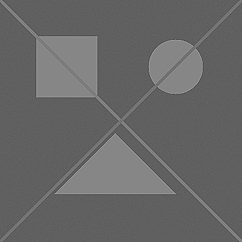
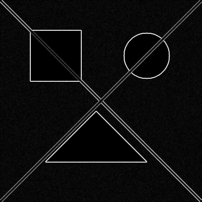
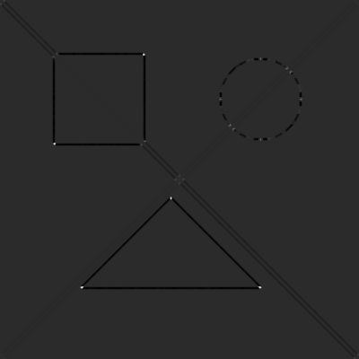

# Taller: Filtros Personalizados y Convolución 2D

**Integrantes:**  
- Joan Sebastian Roberto Puerto  
- Baruj Vladimir Ramírez Escalante  
- Diego Alberto Romero Olmos  
- Maicol Sebastian Olarte Ramirez  
- Jorge Isaac Alandete Díaz  

**Fecha de entrega:** 11 de mayo de 2026  

---

## Descripción breve

Este taller implementa y compara diferentes filtros de convolución aplicados a imágenes, utilizando tanto una **implementación manual** (con bucles en Python puro) como funciones optimizadas de **OpenCV**. Se exploran los efectos de: sharpening (realce de bordes), blur (suavizado), detección de bordes mediante gradientes Sobel y detección de esquinas mediante la respuesta de Harris.

El objetivo es comprender la operación de convolución a bajo nivel y evaluar las diferencias de rendimiento entre una implementación educativa y una biblioteca profesional.

---

## Implementaciones realizadas

### 1. Convolución manual desde cero

Se implementó la función `conv2d_manual(image, kernel)` que recorre píxel a píxel aplicando el kernel con padding reflectante. La fórmula utilizada es:

```
(f * g)[i,j] = ∑ₘ ∑ₙ f[i-m, j-n] · g[m,n]
```

El padding reflectante evita artefactos en los bordes. Esta implementación es **lenta pero didáctica**, permitiendo visualizar paso a paso el proceso de convolución.

```python
def conv2d_manual(image, kernel):
    image = image.astype(np.float32)
    kernel = kernel.astype(np.float32)
    h, w = image.shape
    kh, kw = kernel.shape
    ph, pw = kh // 2, kw // 2
    padded = np.pad(image, ((ph, ph), (pw, pw)), mode="reflect")
    out = np.zeros((h, w), dtype=np.float32)
    for i in range(h):
        for j in range(w):
            region = padded[i:i+kh, j:j+kw]
            out[i, j] = np.sum(region * kernel)
    return out
```

### 2. Kernels definidos

| Kernel | Matriz | Uso |
|--------|--------|-----|
| Sharpening | `[[0,-1,0],[-1,5,-1],[0,-1,0]]` | Realce de bordes y detalles |
| Blur (promedio) | `np.ones((3,3))/9.0` | Suavizado de la imagen |
| Sobel X | `[[-1,0,1],[-2,0,2],[-1,0,1]]` | Gradiente horizontal |
| Sobel Y | `[[-1,-2,-1],[0,0,0],[1,2,1]]` | Gradiente vertical |
| Smooth (para Harris) | `np.ones((3,3))/9.0` | Suavizado de los productos de gradientes |

### 3. Aplicación de filtros

- **Sharpening y Blur** se aplicaron con `conv2d_manual` y `cv2.filter2D`.
- **Gradientes Sobel** se calcularon con `conv2d_manual` y `cv2.Sobel`.
- **Magnitud del gradiente** (bordes): `np.sqrt(ix² + iy²)`.
- **Detección de esquinas (Harris):** se construyó la matriz de segundos momentos a partir de los gradientes y se calculó la respuesta:

```
M = [[Sxx, Sxy],
     [Sxy, Syy]]

R = det(M) - k · tr(M)²
```

donde:
- `Sxx = suavizado(Ix²)`
- `Syy = suavizado(Iy²)`
- `Sxy = suavizado(Ix·Iy)`
- `k = 0.04` (constante de sensibilidad)

Valores altos de `R` indican esquinas; valores muy negativos indican bordes.

### 4. Comparación de tiempos de ejecución

| Implementación | Tiempo total |
|----------------|--------------|
| Manual (Python puro) | 18.954 s |
| OpenCV (`filter2D` + `Sobel`) | 0.012927 s |

**OpenCV es aproximadamente 1466× más rápido** que la versión manual. Esto se debe a que OpenCV está escrito en C/C++ y utiliza instrucciones vectorizadas.

---

## Resultados visuales

Todos los archivos se encuentran en la carpeta `media/`. Las imágenes de la izquierda corresponden a la implementación manual, las de la derecha a OpenCV.

### Imagen original


### Sharpening
| Manual | OpenCV |
|--------|--------|
|  |  |

### Blur (suavizado)
| Manual | OpenCV |
|--------|--------|
|  |  |

### Magnitud del gradiente (bordes)
| Manual | OpenCV |
|--------|--------|
|  |  |

### Respuesta de esquinas (Harris)
| Manual | OpenCV |
|--------|--------|
|  |  |

### Demostración del proceso de convolución (interactivo)


---

## Código relevante

### Función de convolución manual
```python
def conv2d_manual(image, kernel):
    image = image.astype(np.float32)
    kernel = kernel.astype(np.float32)
    h, w = image.shape
    kh, kw = kernel.shape
    ph, pw = kh // 2, kw // 2
    padded = np.pad(image, ((ph, ph), (pw, pw)), mode="reflect")
    out = np.zeros((h, w), dtype=np.float32)
    for i in range(h):
        for j in range(w):
            region = padded[i:i+kh, j:j+kw]
            out[i, j] = np.sum(region * kernel)
    return out
```

### Kernels definidos
```python
kernel_sharpen = np.array([[0, -1, 0], [-1, 5, -1], [0, -1, 0]], dtype=np.float32)
kernel_blur = np.ones((3, 3), dtype=np.float32) / 9.0
sobel_x = np.array([[-1, 0, 1], [-2, 0, 2], [-1, 0, 1]], dtype=np.float32)
sobel_y = np.array([[-1, -2, -1], [0, 0, 0], [1, 2, 1]], dtype=np.float32)
smooth_3x3 = np.ones((3, 3), dtype=np.float32) / 9.0
```

### Respuesta de Harris manual
```python
sxx_manual = conv2d_manual(ix_manual**2, smooth_3x3)
syy_manual = conv2d_manual(iy_manual**2, smooth_3x3)
sxy_manual = conv2d_manual(ix_manual * iy_manual, smooth_3x3)
corner_response_manual = (sxx_manual * syy_manual - sxy_manual**2) - k * (sxx_manual + syy_manual)**2
```

---

## Aprendizajes y dificultades

### Aprendizajes
- Comprensión profunda de la **operación de convolución** y la importancia del **padding** para preservar dimensiones.
- Diferencia entre filtros lineales (blur, gradientes) y no lineales (respuesta de Harris).
- La **respuesta de Harris** combina gradientes y suavizado para identificar esquinas de forma robusta.
- Las bibliotecas optimizadas (OpenCV) pueden ser **tres órdenes de magnitud más rápidas** que implementaciones ingenuas en Python puro.

### Dificultades
- **Rendimiento:** la versión manual tarda ~19 segundos en una imagen de 400×400, lo que evidencia la necesidad de optimizaciones.
- **Normalización:** los resultados de convolución pueden quedar fuera del rango [0,255]; fue necesario implementar `normalize_uint8`.
- **Interpretación de la respuesta de Harris:** distinguir entre esquinas (valores altos positivos) y bordes (valores altos negativos) requirió análisis de rangos.

---

## Checklist de cumplimiento

- [x] Carpeta con formato adecuado.
- [x] `README.md` explicando cada sección (implementación manual, kernels, comparación OpenCV, detección de esquinas).
- [x] Carpeta `media/` con 9 imágenes (original, sharpen manual/cv, blur manual/cv, edges manual/cv, corners manual/cv) y 1 GIF interactivo.
- [x] `conv2d_manual` implementada desde cero.
- [x] Comparativa de tiempos entre manual y OpenCV.
- [x] Commits descriptivos en inglés.
- [x] Repositorio público accesible.