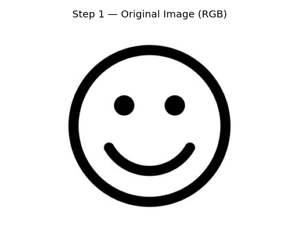
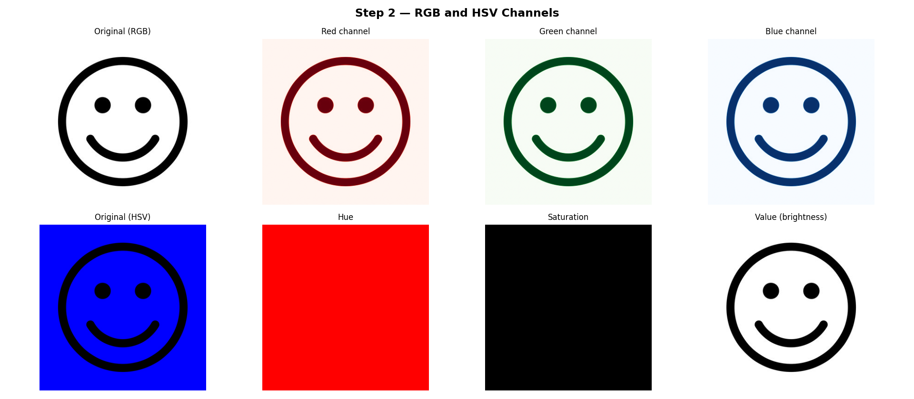
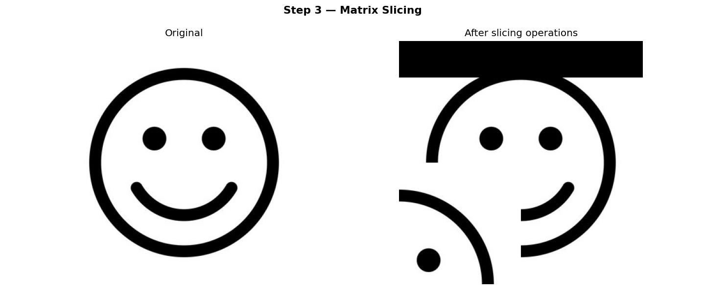
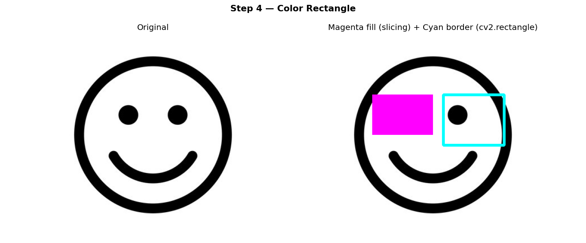
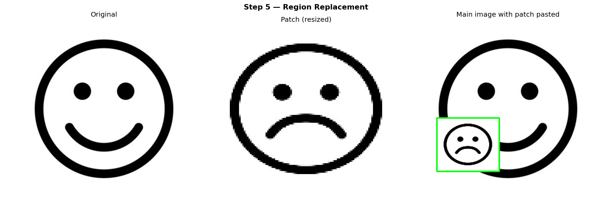
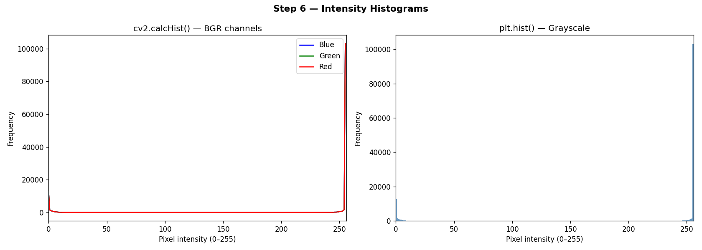
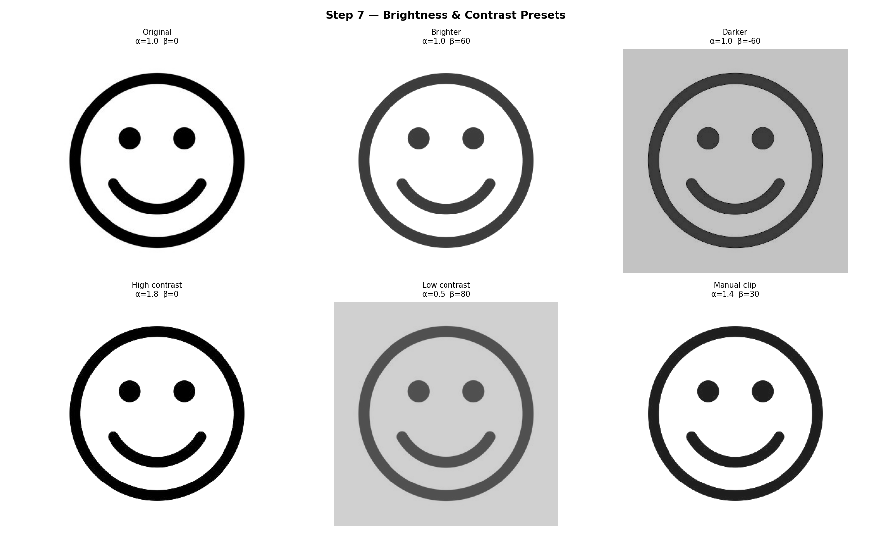
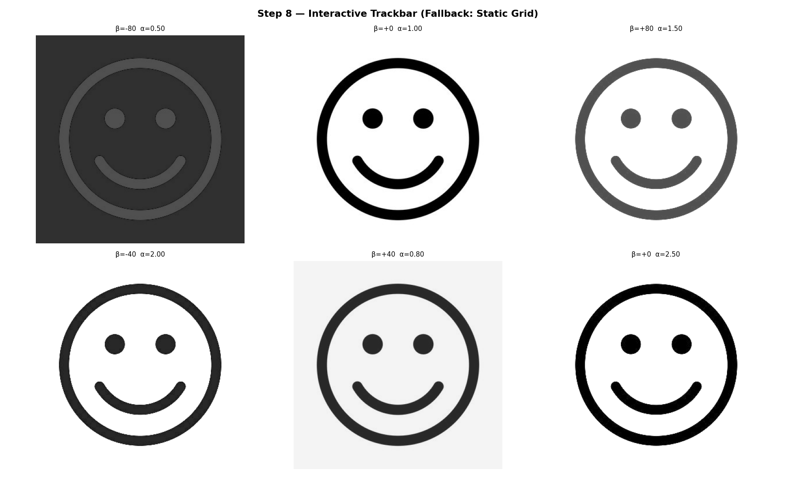

# Titulo

Nombres:

- Joan Sebastian Roberto Puerto
- Baruj Vladimir Ramírez Escalante
- Diego Alberto Romero Olmos
- Maicol Sebastian Olarte Ramirez
- Jorge Isaac Alandete Díaz

Fecha de entrega: 11/05/2026
Descripción breve: El taller se centra en una implementación de python teniendo en cuenta la representación de las imagenes como matrices númericas, para modificar los componentes de la misma a nivel de cada pixel.

Se trabaja modificando valores de color y brillo. Adicionalmente se modifican regiones especificas de la imagen.

## Implementaciones

- **Python**: La implentación de python se divide en 8 pasos para cumplir lo solicitado. La siguiente tabla tiene una descripción brebe de lo que hace cada parte del código.

 Paso | ¿Qué hace? |
|---------|-----------|
| 1 | Carga la imagen con cv2.imread() (BGR) |
| 2 | Divide en canales R, G, B y H, S, V |
| 3 | Oscurece (pone en negro) una franja superior; aplica efecto espejo a un cuadrante |
| 4 | Dibuja un rectángulo de color sólido (magenta) y un rectángulo de borde (cian) |
| 5 | Pega un recorte de una segunda imagen en una ROI (Región de Interés) |
| 6 | Grafica histogramas BGR y un histograma de escala de grises |
| 7| Muestra 6 ajustes preestablecidos (más brillante, más oscuro, alto/bajo contraste…) |
| 8 | Ventana en vivo con dos deslizadores (sliders) |

## Resultados visuales

A continuación se muestran los resultados visuales generados por cada paso del código. Se utilizan dos imagenes de una cara feliz y otra triste en blanco y negro como demostración de las funciones

- **Python**:







*Los histogramas aparecen de este modo por usar imagenes que contienen principalmente blanco y negro*





## Código relevante

El código realizado en python se divide en 8 pasos segun lo solicitado en los requisitos del taller

### 1. Cargar una imagen a color

```python
bgr = cv2.imread("main.jpg")
rgb = cv2.cvtColor(bgr, cv2.COLOR_BGR2RGB)
```

> **⚠️ Error común:** OpenCV carga las imágenes en orden **BGR**, no RGB.  
> Siempre convierte con `cv2.cvtColor()` antes de mostrar la imagen con matplotlib.

---

### 2. Acceder y separar canales

```python
# Canales RGB
R, G, B = cv2.split(rgb)

# Canales HSV
hsv = cv2.cvtColor(bgr, cv2.COLOR_BGR2HSV)
H, S, V = cv2.split(hsv)
```

> `cv2.split()` separa una imagen de 3 canales en tres arreglos 2D independientes.  
> **HSV** es útil para segmentación por color — H codifica el tono puro, S la saturación y V el brillo.

---

### 3. Slicing de matrices para modificar regiones

```python
# Oscurecer el 15% superior de la imagen
img[0 : int(h * 0.15), :] = 0

# Copiar un cuadrante en otro
img[q_h:h, 0:q_w] = cv2.resize(source_region, (q_w, q_h))
```

> Sintaxis de slicing en NumPy: `img[fila_inicio:fila_fin, col_inicio:col_fin]`.  
> Asignar un escalar o un arreglo de la misma forma **modifica la imagen directamente en memoria**.  
> Trabaja siempre sobre una copia con **`.copy()`** para conservar la imagen original.

---

### 4. Colorear un área rectangular

```python
# Rellenar con magenta sólido usando slicing (BGR: 255, 0, 255)
img[y1:y2, x1:x2] = [255, 0, 255]

# Dibujar solo el borde con cv2.rectangle()
cv2.rectangle(img, pt1=(x1, y1), pt2=(x2, y2), color=(255, 255, 0), thickness=4)
```

> Dos herramientas complementarias:
> - **Slice de NumPy** → rellena toda la región con un color.  
> - **`cv2.rectangle()`** → dibuja únicamente el contorno; usa `thickness=-1` para rellenar también el interior.

---

### 5. Reemplazar una región con un parche de otra imagen

```python
patch_bgr  = cv2.imread("patch.jpg")
patch_resized = cv2.resize(patch_bgr, (roi_w, roi_h))   # ajustar exactamente al ROI
img[y1:y2, x1:x2] = patch_resized                       # pegar
```

> El parche **debe redimensionarse** para coincidir con las dimensiones del ROI antes de asignarlo —  
> de lo contrario NumPy lanzará un error de incompatibilidad de formas.

---

### 6. Histogramas de intensidad

```python
# A — cv2.calcHist: un canal a la vez
hist = cv2.calcHist([bgr], channels=[i], mask=None, histSize=[256], ranges=[0, 256])

# B — matplotlib: aplanar primero el arreglo 2D
plt.hist(gray.ravel(), bins=256, range=(0, 256))
```

> | Parámetro | Significado |
> |-----------|-------------|
> | `channels=[i]` | índice del canal a analizar |
> | `mask=None` | usa toda la imagen (pasa una máscara binaria para restringir el área) |
> | `histSize=[256]` | número de intervalos (bins) |
> | `ranges=[0, 256]` | rango de valores de píxel |

> `gray.ravel()` convierte el arreglo 2D en una lista 1D con todos los valores de píxel — necesario para `plt.hist()`.

---

### 7. Ajuste de brillo y contraste

#### La ecuación

```
salida = clip( α × entrada + β , 0, 255 )
```

| Variable | Rol | Efecto |
|----------|-----|--------|
| `α` (alpha) | multiplicador de contraste | `α > 1` → más contraste; `α < 1` → menos |
| `β` (beta)  | desplazamiento de brillo   | `β > 0` → más brillo; `β < 0` → más oscuro |

```python
# A — Manual (NumPy)
manual = np.clip(alpha * bgr.astype(np.float32) + beta, 0, 255).astype(np.uint8)

# B — OpenCV (misma fórmula, ruta optimizada en C++)
result = cv2.convertScaleAbs(bgr, alpha=alpha, beta=beta)
```

> Ambos enfoques producen **resultados idénticos**.  
> `cv2.convertScaleAbs()` es preferible en producción — maneja internamente la conversión a float, el escalado y el recorte de valores.

---

### 8. Trackbars interactivos

```python
cv2.namedWindow("Window", cv2.WINDOW_NORMAL)
cv2.createTrackbar("Brightness", "Window", 100, 200, nothing)  # default=100, max=200
cv2.createTrackbar("Contrast",   "Window", 100, 300, nothing)

while True:
    bright_raw = cv2.getTrackbarPos("Brightness", "Window")
    contrast   = cv2.getTrackbarPos("Contrast",   "Window")

    beta  = bright_raw - 100        # remap [0,200] → [-100,+100]
    alpha = contrast / 100.0        # remap [0,300] → [0.0, 3.0]

    result = cv2.convertScaleAbs(bgr, alpha=alpha, beta=beta)
    cv2.imshow("Window", result)

    if cv2.waitKey(30) & 0xFF in (ord("q"), 27):   # Q o ESC
        break

cv2.destroyAllWindows()
```

> **Tres cosas importantes:**
> 1. `cv2.createTrackbar()` solo admite **enteros no negativos** — usa un offset para simular valores negativos.
> 2. El callback `nothing` (`def nothing(_): pass`) es **obligatorio** aunque no se use.
> 3. `cv2.waitKey(30)` mantiene la ventana activa; la máscara `& 0xFF` garantiza la detección correcta de teclas en todas las plataformas.

**Prompts utilizados:**

Se utilizó el siguiente prompt para generar el código principal de python usando Claude.

```plaintext

Hi, I need help programming a problem for a visual computing workshop using python with opencv, numpy and matplotlib. These are the steps that I must follow:
1. load an image with color using  cv2
2. Access and and show RBG and HSV channels
3. Use slicing of matrices for modifiying specific regions of the image.
4. Change the color of a rectangular area.
5. Replace a region of the image with another of another image
6. Calculete and visualize the histogram of intensities with cv2.calcHist() or matplotlib.pyplot.hist()
7. Apply brightness and contrast manual settings (with ecuation) or with functions of openCV (cv2.contrastScaleAbs())
8. Create an interactive function with sliders to modify brightness and contrast in real time using cv2.createTrackbar()

```

**Aprendizajes y dificultades:**

El taller ayuda con la comprensión del funcionamiento de la representación de las imagenes a su vez que se su modificación usando su representacion como matrices númericas. Se intentó implementar una función para que se descarge directamente de internet, pero parece producir errores inesperados.
