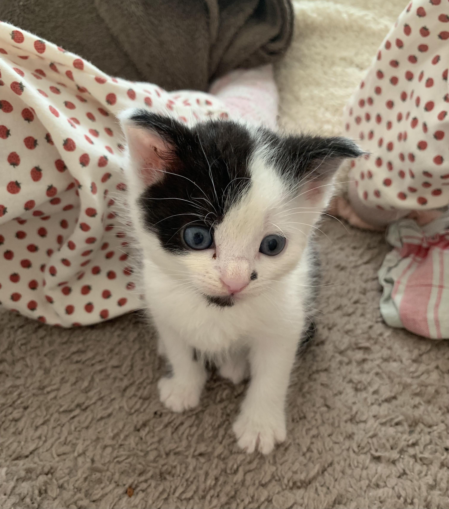
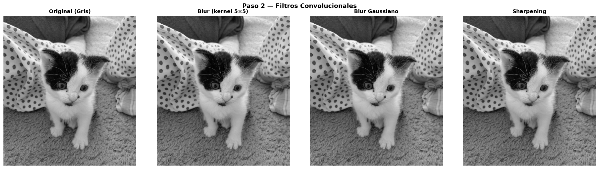
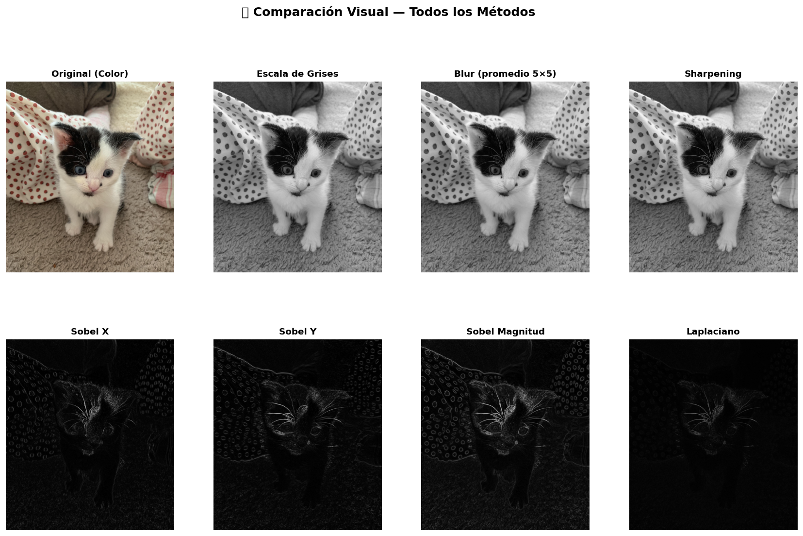

# Taller Ojos Digitales — Visión Artificial

**Estudiantes:**

- Joan Sebastian Roberto Puerto
- Baruj Vladimir Ramírez Escalante
- Diego Alberto Romero Olmos
- Maicol Sebastian Olarte Ramirez
- Jorge Isaac Alandete Díaz

**Fecha de entrega:** Mayo 3 de 2025

---

## Descripción

Este taller fue una primera inmersión práctica en el campo de la visión artificial. El objetivo central era entender cómo los computadores perciben e interpretan imágenes, algo que para los humanos resulta tan natural como abrir los ojos, pero que para una máquina implica una cadena de operaciones matemáticas bastante elaborada.

Para lograrlo, trabajamos con OpenCV en un entorno de Google Colab, procesando una imagen de un gato (`kitty.jpg`) a través de distintas etapas: conversión a escala de grises, aplicación de filtros convolucionales y detección de bordes usando tres métodos distintos — Sobel, Laplaciano y Canny. Todo el proceso se documenta visualmente dentro del mismo notebook, lo que permitió comparar los resultados de cada técnica de forma directa e intuitiva.

---

## Implementaciones

### Entorno: Google Colab (Python)

El desarrollo completo se realizó en un notebook de Colab, lo que facilitó la ejecución sin necesidad de configurar un entorno local. Las librerías utilizadas fueron `opencv-python-headless`, `numpy`, `matplotlib` e `ipywidgets`.

**Conversión a escala de grises**

El primer paso fue convertir la imagen original de color (formato RGB, tres canales) a una imagen en escala de grises de un solo canal. OpenCV aplica internamente la fórmula de luminancia perceptual `Gray = 0.114·B + 0.587·G + 0.299·R`, que pondera más el canal verde porque el ojo humano es más sensible a él. Esta reducción de dimensionalidad es importante porque simplifica los cálculos de los pasos posteriores sin perder información estructural relevante.

**Filtros convolucionales — Blur y Sharpening**

Una vez en escala de grises, aplicamos dos filtros convolucionales contrastantes. El blur (suavizado) utiliza un kernel de promedio de 5×5 que reemplaza cada píxel con el promedio de sus vecinos, eliminando ruido y detalles finos. También probamos el blur gaussiano nativo de OpenCV, que aplica pesos decrecientes según la distancia al centro del kernel, logrando un suavizado más natural y menos cuadrado.

El filtro de sharpening hace exactamente lo contrario: refuerza el valor del píxel central restando el aporte de sus vecinos, lo que exagera los cambios de intensidad y hace que los bordes y texturas se perciban con más nitidez.

```python
kernel_blur  = np.ones((5, 5), dtype=np.float32) / 25

kernel_sharp = np.array([[ 0, -1,  0],
                          [-1,  5, -1],
                          [ 0, -1,  0]], dtype=np.float32)

img_blur   = cv2.filter2D(img_gray, -1, kernel_blur)
img_sharp  = cv2.filter2D(img_gray, -1, kernel_sharp)
```

**Detección de bordes — Operador Sobel**

El operador Sobel calcula la primera derivada de la imagen en dos direcciones independientes. El kernel Sobel X detecta cambios horizontales de intensidad (es decir, resalta los bordes verticales), mientras que Sobel Y hace lo propio con los cambios verticales. Combinando ambos mediante la magnitud del gradiente `√(Gx² + Gy²)` se obtiene una imagen donde todos los bordes relevantes quedan marcados, sin importar su orientación.

```python
sobel_x   = cv2.Sobel(img_gauss, cv2.CV_64F, dx=1, dy=0, ksize=3)
sobel_y   = cv2.Sobel(img_gauss, cv2.CV_64F, dx=0, dy=1, ksize=3)
sobel_mag = np.sqrt(sobel_x**2 + sobel_y**2)
```

**Detección de bordes — Operador Laplaciano**

El Laplaciano trabaja con la segunda derivada de la imagen. A diferencia de Sobel, no distingue entre direcciones: detecta cambios bruscos de intensidad en todas las orientaciones a la vez. Esta ventaja tiene un costo: es considerablemente más sensible al ruido, por lo que es importante aplicar un suavizado previo antes de usarlo. Para el taller comparamos dos versiones con distintos tamaños de kernel (ksize=3 y ksize=5) para ver cómo afecta la resolución del resultado.

**Comparación visual y widget interactivo (Bonus)**

El taller cierra con una figura resumen que agrupa todos los resultados en un solo panel, y con un widget interactivo construido con `ipywidgets`. Este widget permite seleccionar el tipo de filtro mediante un menú desplegable y ajustar parámetros como el tamaño del kernel, el valor de sigma o los umbrales de Canny usando sliders en tiempo real. Esta funcionalidad reemplaza a `cv2.createTrackbar`, que no es compatible con entornos de notebook como Colab.

```python
interact(
    aplicar_filtro,
    tipo_filtro = Dropdown(options=['Gaussian Blur', 'Sobel X', 'Laplaciano', 'Canny', ...]),
    kernel_size = IntSlider(min=1, max=21, step=2, value=5),
    canny_low   = IntSlider(min=0, max=150, step=5, value=50),
    canny_high  = IntSlider(min=50, max=300, step=10, value=150),
    sigma       = IntSlider(min=0, max=10, step=1, value=1),
)
```

---

## Resultados Visuales

Los resultados que se muestran a continuación corresponden al procesamiento de `kitty.jpg`, la imagen de prueba utilizada a lo largo de todo el taller.

### Imagen original

La imagen de entrada es una fotografía a color de un gato, con buena variedad de texturas (pelo, fondo) que la hace ideal para observar el efecto de cada técnica.



### Filtros convolucionales

En esta comparación se puede ver cómo el blur suaviza los contornos y reduce el detalle, mientras que el sharpening hace todo lo contrario: los bordes del pelaje y los rasgos del rostro se ven más definidos y marcados.



### Comparación de detectores de bordes

Esta imagen agrupa el resultado de todos los métodos implementados: la imagen original, la versión en escala de grises, los filtros convolucionales y los detectores de bordes Sobel Y, Sobel Magnitud y Laplaciano. Permite ver de un vistazo cómo cada técnica responde a los mismos datos de entrada.



---

## Prompts Utilizados

Durante el desarrollo del taller se utilizó asistencia de IA generativa para construir la estructura base del notebook. El prompt principal que se usó fue el siguiente:

> *"Crea un notebook de Google Colab en Python para un taller de visión artificial con OpenCV. Debe incluir: carga de una imagen llamada kitty.jpg, conversión a escala de grises, filtros convolucionales (blur y sharpening con kernels definidos manualmente), detección de bordes con Sobel X, Sobel Y, magnitud, y Laplaciano. Agrega una comparación visual con matplotlib, histogramas de intensidad por método, y un bonus con sliders interactivos usando ipywidgets. Incluye explicaciones en celdas Markdown con las fórmulas matemáticas relevantes."*

La IA generó una estructura sólida del notebook que luego revisamos y ajustamos, verificando que cada función de OpenCV estuviera correctamente parametrizada y que las visualizaciones correspondieran a lo esperado. Algunos kernels y la lógica del widget interactivo fueron refinados manualmente durante las pruebas.

---

## Aprendizajes y Dificultades

Una de las cosas que más llamó la atención durante el taller fue entender que los filtros, por sofisticados que parezcan, son en el fondo operaciones de multiplicación y suma sobre matrices. Ver un kernel de 3×3 transformar completamente la apariencia de una imagen hace que el concepto de convolución deje de ser abstracto y se vuelva tangible.

Otro aprendizaje importante fue notar que el orden de los pasos importa. Aplicar el suavizado gaussiano antes del detector Laplaciano o Sobel no es un detalle menor: sin ese paso previo, el ruido natural de la imagen genera bordes falsos que contaminan el resultado. Entender por qué se hace cada cosa, y no solo cómo, fue parte esencial del proceso.

La mayor dificultad técnica estuvo en el manejo de tipos de dato. OpenCV devuelve gradientes en `CV_64F` (valores negativos incluidos) y si no se convierten correctamente con `convertScaleAbs` antes de visualizar, la imagen aparece casi completamente negra. Esto costó algunos minutos de depuración hasta identificar la causa.

Por último, la incompatibilidad de `cv2.createTrackbar` con Colab fue una limitación esperada, pero resuelta satisfactoriamente con `ipywidgets`, que en la práctica ofrece una experiencia incluso más cómoda dentro del entorno de notebook.

En general, el taller cumplió su objetivo: entender que una máquina no "ve" como nosotros, sino que mide diferencias de intensidad, aplica operaciones matemáticas sobre matrices de píxeles y construye a partir de eso una representación útil del mundo visual.