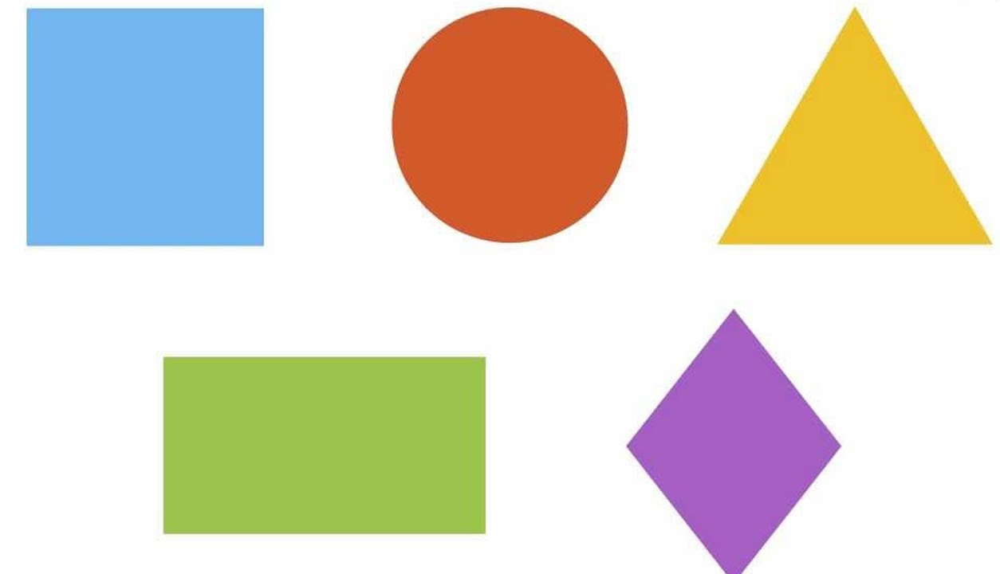
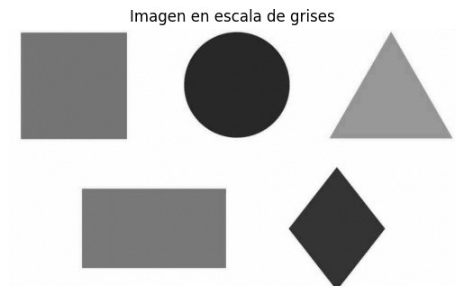
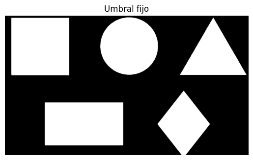
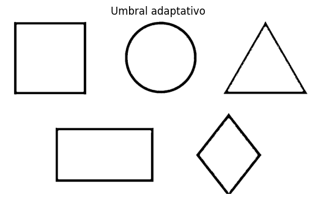
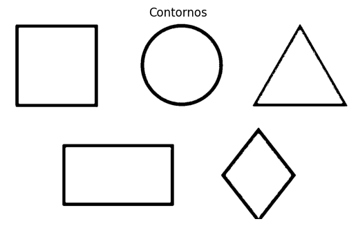
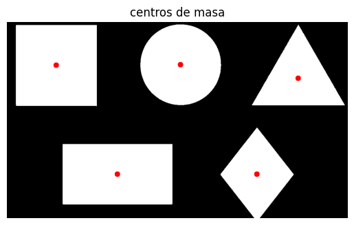
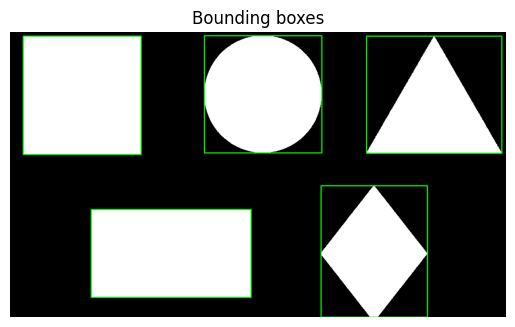
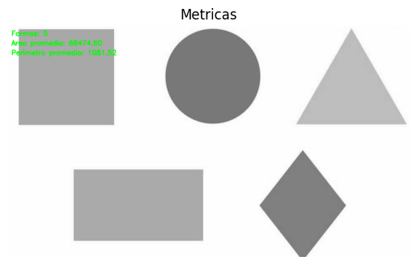

# Taller 9-5 – Segmentando el Mundo: Binarización y Reconocimiento de Formas

**Integrantes:**  
- Joan Sebastian Roberto Puerto  
- Baruj Vladimir Ramírez Escalante  
- Diego Alberto Romero Olmos  
- Maicol Sebastian Olarte Ramirez  
- Jorge Isaac Alandete Díaz  

**Fecha de entrega:** 6 de marzo de 2026  

---

## Descripción breve

### Python

Se busca la deteccion de formas en imagenes aplicando tecnicas de segmentacion y umbralizacion, mediante umbrales, contornos, centros de masa, areas, entre otras.


## Implementaciones

### Python

1. Como primer apso se importan las librerias, para el analisis de imagenes se usa la libreria **opencv**, para el manerjo de las imagenes **numpy** y para la visualizacion de las imagenes **matplotlib**

2. Se carga la imagen (*figuras*) y se la aplica un filtro para asegurar que la imagen este en escalas de grises (*imagen_gris*).

3. Mediante un umbral fijo se aplica una segmentacion binaria invertida sobre la imagen en escala de grises (*imagen_binaria*).

4. Mediante un umbral variable se aplica una segmentacion binaria invertida sobre la imagen en escala de grises (*imagen_binaria_umbral_adaptativo*).

5. Mediante la funcion de cv2 **findContours()** con un modo de recuperación **RETR_TREE** que toma todos los contornos y los contruye en forma jerarquica los objetos anidados y con el modo de aproximación **CHAIN_APPROX_SIMPLE** que comprime los segmentos de forma que se conserven sus extremos. Despues de esto se filtran los contornos para tomar aquellos cuya area es mayor a un limite ignorando los contornos pequeños comunmente asociados a errores.

6. Con la funcion de cv2 **moments()** se calcula los momentos de los momentos, para despues calcular las cordenadas X y Y de los centroides mediante las expresiones

$$ X = \frac{momento[m10]}{momento[m00]} $$
$$ Y = \frac{momento[m01]}{momento[m00]} $$

- Añadiendo un circulo rojo sobre la imagen en las cordenadas X y Y de los centroides. 

7. Para el calculo de las Bounding boxes se usa la funcion de cv2 **boundingRect** sobre cada contorno, para despues añadir las cajas sobre la imagen.

8. Se calcula las areas y perimetros de los contornos mediante las funciones de cv2 **contourArea** y **arcLength** respectivamente, despues calculando el promedio de estas mediciones de los contornos.
## Resultados visuales

- Se muestra la imagen original *figuras*


- Se muestra la imagen *figuras* en escala de grises *imagen_binaria*


- Se muestra el umbral fijo de la imagen *imagen_binaria*


- Se muestra el umbral adaptativo de la imagen *imagen_binaria*


- Se muestra los contornos de la imagen *imagen_binaria*


- Se muestra los centros de masa calculado en base a los *contornos*


- Se muestra las Bounding boxes calculadas en base a los *contornos*


- Al final se muestran las metricas identificando: **5 Formas**,
un **area** promedio de **68474.60**
Y un **perimetro** promedio de **1081.52**



## Código relevante

calculo de los centros de masa usando los momentso y contornos.

```python
for i in contornos_filtrados:
  momentos.append( cv2.moments(i) )

centros_de_masa = []

for momento in momentos:
  if momento['m00'] != 0:
    cx = int(momento['m10'] / momento['m00'])
    cy = int(momento['m01'] / momento['m00'])

    centros_de_masa.append([cx,cy])
```


## Prompts de IA utilizados (Chatgpt)


1. ¿Cuales son las entradas de la funcion *cv2.findContours* de opencv-python?

2. ¿Cual es la salida de la fucion de cv2 *cv2.moments*?


## Aprendizajes y dificultades

### Aprendizajes

- Comprender las diferencias entre segmentación binaria con umbral fijo y segmentacion binaria con umbral adaptativo.

- El uso de CHAIN_APPROX_SIMPLE para optimizar la representación de contornos reduciendo puntos innecesarios.

- Filtrar contornos pequeños mediante el área para eliminar ruido y falsos positivos

### Dificultades

- Ajustar correctamente los valores de umbral fijo para segmentar adecuadamente los objetos en distintas condiciones de color e iluminación

- Filtrar adecuadamente contornos pequeños sin eliminar objetos relevantes de la imagen.

- Coordinar la visualización correcta de imágenes con matplotlib